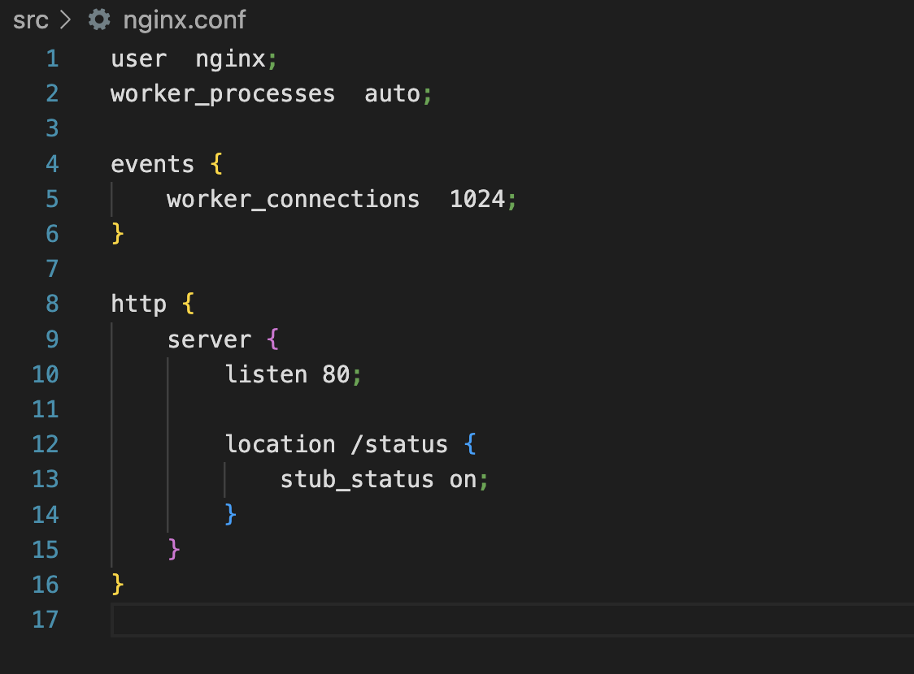
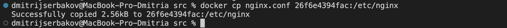

### S21_SimpleDocker report

#### Part 1. Ready-made docker

##### Take the official docker image from nginx and download it using `docker pull`

##### Check for the docker image with `docker images`

##### Run docker image with `docker run -d [image_id|repository]`

##### Check that the image is running with `docker ps`

##### View container information with `docker inspect [container_id|container_name]`

##### From the command output define and write in the report the container size, list of mapped ports and container ip

##### Stop docker image with docker stop `[container_id|container_name]`

##### Check that the image has stopped with `docker ps`

##### Run docker with ports 80 and 443 in container, mapped to the same ports on the local machine, with `run` command

##### Check that the nginx start page is available in the browser at `localhost:80`

##### Restart docker container with `docker restart [container_id|container_name]`
##### Check in any way that the container is running

#### Part 2. Operations with container

##### Read the nginx.conf configuration file inside the docker container with the `exec` command

##### Create a nginx.conf file on a local machine

##### Configure it on the /status path to return the nginx server status page

##### Copy the created nginx.conf file inside the docker image using the `docker cp` command

##### Restart nginx inside the docker image with `exec`

##### Check that `localhost:80/status` returns the nginx server status page

##### Export the container to a container.tar file with the `export` command

##### Stop the container

##### Delete the image with `docker rmi [image_id|repository]` without removing the container first

##### Delete stopped container

##### Import the container back using the `import` command

##### Run the imported container

##### Check that localhost:80/status returns the nginx server status page

### Part 3. Mini web server

#### Write a mini server in C and FastCgi that will return a simple page saying Hello World!

#### Write your own nginx.conf that will proxy all requests from port 81 to 127.0.0.1:8080

#### Run the written mini server via spawn-fcgi on port 8080

#### Copy file .conf

#### Install gcc and fcgi 

#### Compile and run spawn-fcgi

#### Restart

#### Check that browser on localhost:81 returns the page you wrote 

#### Put the nginx.conf file under ./nginx/nginx.conf (you will need this later)

### Part 4. Your own docker

#### Write your own docker image that:

1) builds mini server sources on FastCgi from Part 3
2) runs it on port 8080
3) copies inside the image written ./nginx/nginx.conf
4) runs nginx

#### Build the written Docker image via docker build, specifying the name and tag

#### Check image

#### Run the built docker image by mapping port 81 to 80 on the local machine and mapping the ./nginx folder inside the container to the address where the nginx configuration files are located

#### Check that the page of the written mini server is available on localhost:80

#### Add proxying of /status page to return the nginx server status

#### Restart docker image

#### Check that localhost:80/status now returns a page with nginx status

### Part 5. Dockle

#### Install dockle

#### Check the image from the previous task with dockle `[image_id|repository]`

#### Fix the image so that there are no errors or warnings when checking with dockle

###  Part 6. Basic Docker Compose

##### Write a docker-compose.yml file, using which:
1) Start the docker container from Part 5 

2) Start the docker container with nginx which will proxy all requests from port 8080 to port 81 of the first container

##### Map port 8080 of the second container to port 80 of the local machine

##### Stop all running containers

##### Build and run the project with the `docker-compose build` and `docker-compose up` commands

##### Check that the browser returns the page you wrote on localhost:80 as before

